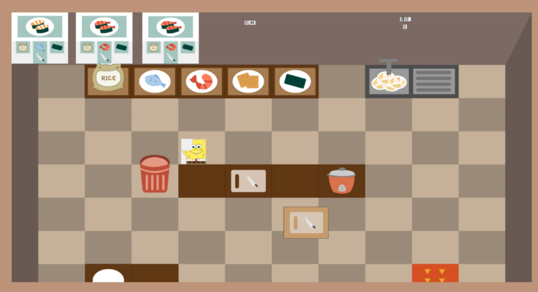

# CookingMaster
## + 我們參考的對象「overcooked」是一款玩法新奇的遊戲,藉由菜單、場地的變化,總能產生許多意想不到的意外和挑戰。

## + 我們想透過製作此有一定複雜度的遊戲,來提高我們對Visual Basic 的熟練度。

+ 單人經營模擬遊戲,畫面採用2D俯視固定視角。
+ 玩家必須在時間內完成餐點的製作並交付以獲得分數。每道料理有其特定的製作過程,若沒按照流程則餐點無法生成。
+ 不同的關卡地圖上也會有不同的擺設和不同的食材與烹飪方式,主要考驗玩家們的「細心」。

